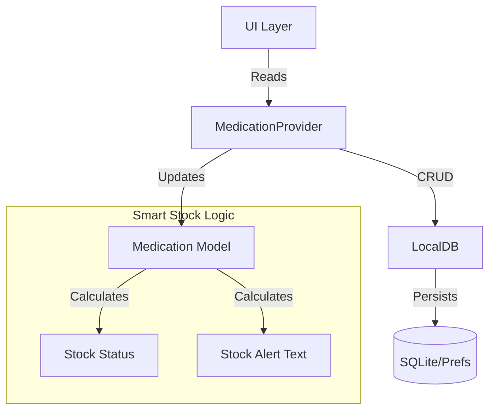

# MediTime Architecture

## 1. Overview
MediTime is a Flutter application designed for elderly users to manage medications. It utilizes a **Clean Architecture** approach with **Riverpod** for state management and **SQLite** for local persistence.

## 2. Layers

### Presentation Layer
- **Screens**: `LoginScreen`, `MedsListScreen`, `CalendarScreen`, `AddMedicationScreen`.
- **State Management**: `ConsumerWait` / `ConsumerStatefulWidget` using Riverpod.
- **Theme**: High contrast, large fonts, accessibility-first design.

### Domain Layer (Models)
- **`Medication` Model**:
  - Core logic for "Smart Stock".
  - Getters: `stockStatus` (CRITICAL, LOW, SURPLUS), `stockDescription` ("FALTAM 20!"), `dosesNeeded`.
  - **Color Logic**: Stores `int color` (ARGB) for consistent UI coding.

### Data Layer
- **`LocalDB`**: Singleton wrapper around `sqflite` (Android/iOS) and `SharedPreferences` (Web fallback).
- **`MedicationProvider`**: Riverpod `StateNotifier` acting as the Controller/Repository bridge.

## 3. Data Flow

### Smart Stock Logic
1.  **Input**: User enters `totalQuantity` (e.g., 10), `quantityPerDose` (e.g., 1), `startDate`, `endDate`.
2.  **Calculation**: `Medication` model calculates:
    - `daysDuration` = `endDate` - `startDate`.
    - `dosesNeeded` = `daysDuration` * (doses/day).
    - `dosesAvailable` = `totalQuantity` / `quantityPerDose`.
    - `missing` = `dosesNeeded` - `dosesAvailable`.
3.  **UI Output**:
    - **CRITICAL**: If `dosesAvailable` < 2 days worth.
    - **LOW (Red)**: If `missing` > 0.
    - **SURPLUS (Green)**: If `missing` <= 0.

### Color Flow
1.  **Creation**: Random pastel color assigned in `AddMedicationScreen`.
2.  **Storage**: Color saved as `INTEGER` in SQLite.
3.  **Display**:
    - **List**: Left-border strip & Icon color.
    - **Calendar**: Dot marker color for each day.

## 4. Mermaid Diagram

