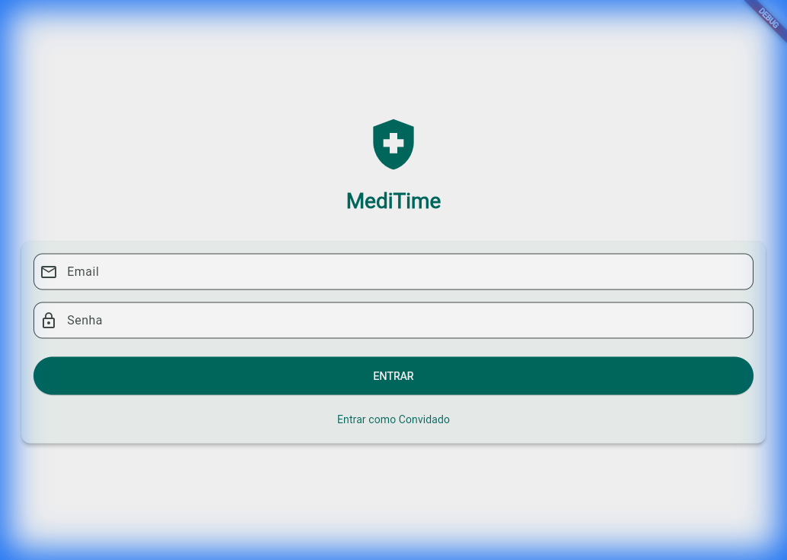
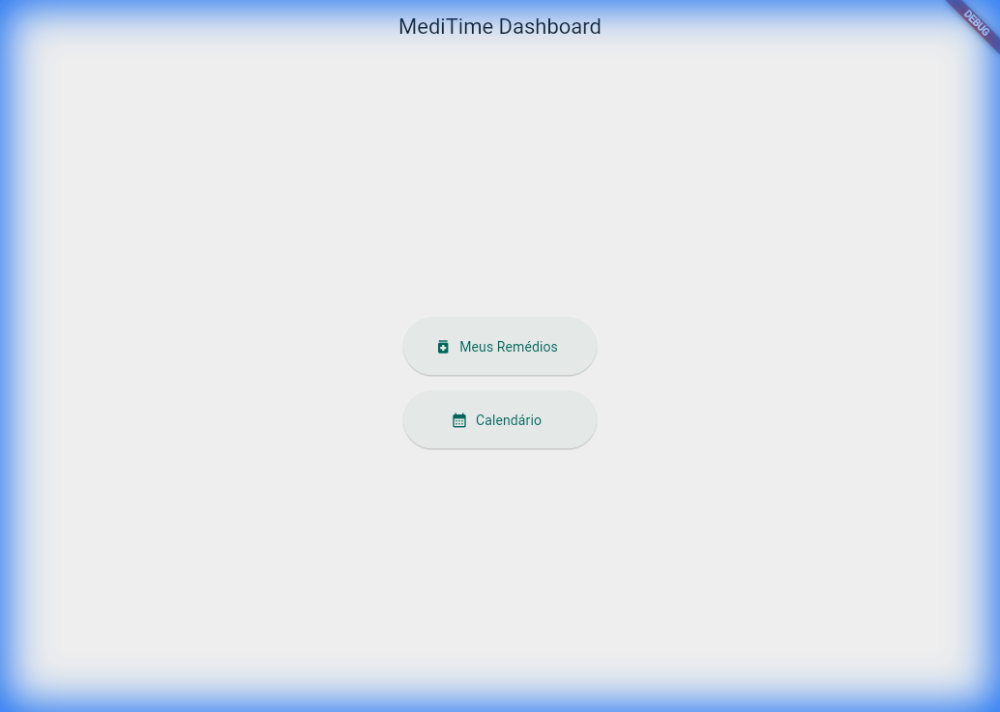
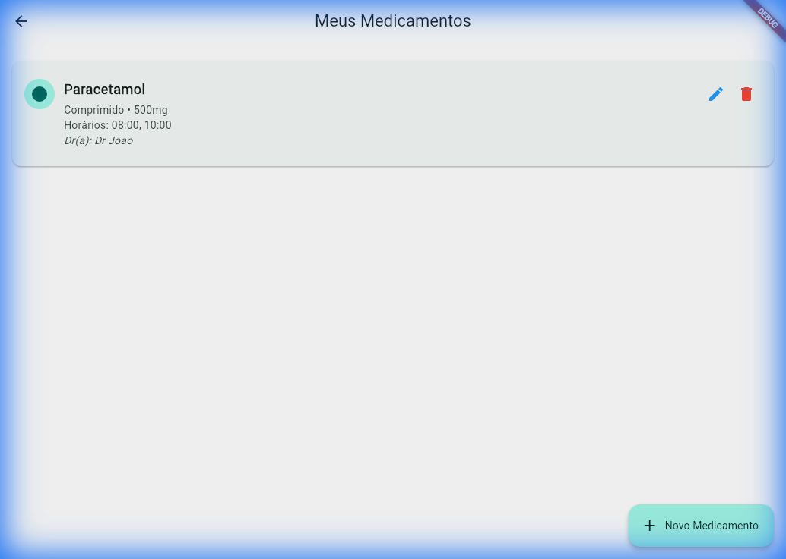
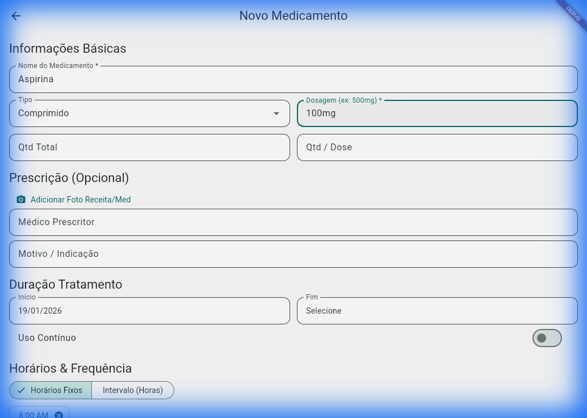
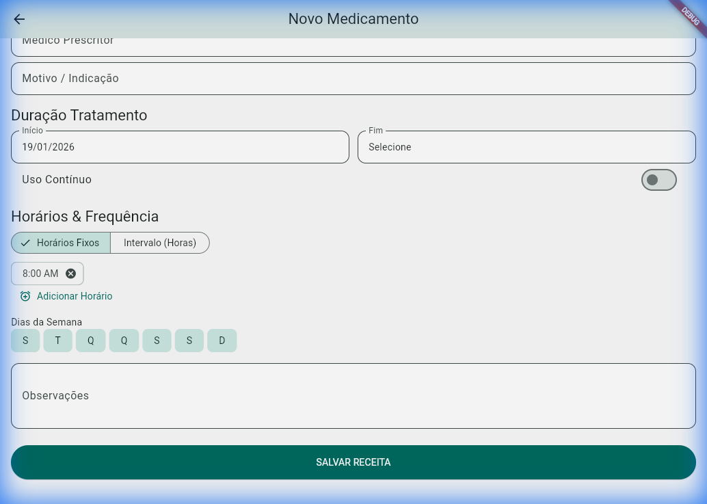
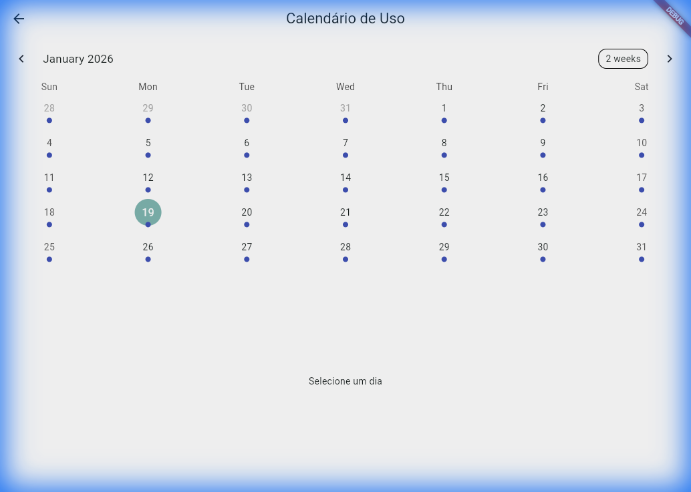

# Human-Machine Interface (HMI)

## User Flow
The application follows a linear and intuitive flow designed for ease of use.

### 1. Authentication
-   **Screen**: `LoginScreen`
-   **Action**: User enters Email/Password or selects "Entrar como Convidado".
-   **Feedback**: Loading spinner during auth, SnackBar on error.

### 2. Dashboard (Home)
-   **Screen**: `HomeScreen`
-   **Action**: Central hub to navigate to Medications, Calendar, or Profile.

### 3. Medication List
-   **Screen**: `MedsListScreen`
-   **Display**: Cards showing Med Name, Dosage, Type Icon, and Doctor.
-   **Actions**:
    -   **Add**: FAB (+) opens Form.
    -   **Edit**: Pencil icon on card.
    -   **Delete**: Trash icon on card.

### 4. Adding/Editing Medication
-   **Screen**: `AddMedicationScreen`
-   **Top Section**: Basic Info (Name, Type, Dosage).
    -   *UX*: Autocomplete for common names.
    -   *UX*: Dropdown for types.

-   **Bottom Section**: Schedule, Visuals, Notes.
    -   *UX*: Dynamic scheduling (Fixed vs Interval).
    -   *UX*: Image Picker for prescriptions.

### 5. Calendar View
-   **Screen**: `CalendarScreen`
-   **Display**: Monthly view with markers for days with scheduled meds.
-   **Action**: Select a day to see the list for that specific date.

## UX Guidelines
1.  **Accessibility**: Large touch targets (min 48px), high contrast colors (Teal/White).
2.  **Feedback**: Every destructive action (delete) or save action shows a visible confirmation (SnackBar/Dialog).
3.  **Validation**: Forms do not submit without required fields (Name, Dosage). Invalid fields highlight in red with error text.
4.  **Resilience**: App works offline (cached data) and persists state across reloads (even on Web).
